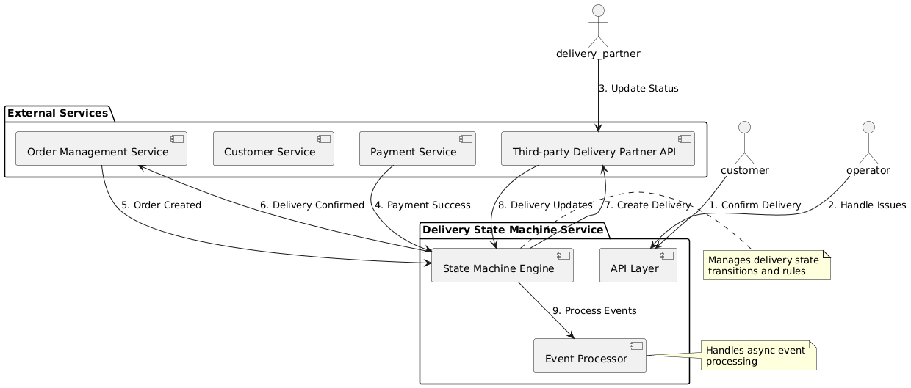
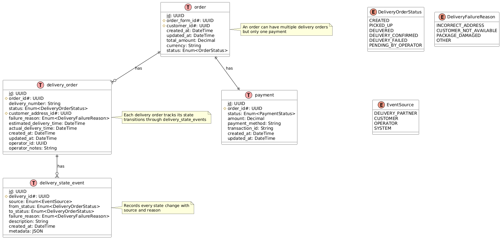

# Delivery State Machine Service - System Design

## High Level Introduction
This e-commerce application follows a business-to-customer (B2C) model, enabling customers to browse and purchase books through a web interface. 
After a customer selects books and completes payment, the books are packed and a delivery is arranged from the physical bookstore to the customer’s address. 
This is a typical, streamlined e-commerce system whose core functionality is organized into sub-domains such as product, customer, ordering, payment, delivery, and order management, each represented as a microservice. Peripheral domains, including operations (for internal staff), communications, and recommendation systems, are outside the scope of this design. 
Each domain is managed by a domain owner and supported by one or more microservices.

The microservices of other related domains all provide basic RESTFUL APIs for CRUD operations, and message queues for notifications. The details of the other domains are not in this doc. 

Read
- The core domains related to the delivery domain 
- The entity relation model of the core domains and core entities in 

## System Architecture

### Service Components
- **API Layer**: FastAPI application handling HTTP requests and WebSocket connections
- **State Machine Engine**: Core business logic for state transitions
- **Event Processor**: Celery workers for async event processing
- **Message Queue**: RabbitMQ for event-driven communication
- **Database**: PostgreSQL for persistent storage
- **Cache Layer**: Redis for caching frequently accessed data
- **Monitoring**: Prometheus metrics and Grafana dashboards
- **Logging**: ELK stack for centralized logging

### Integration Points
- Payment Service (Event Consumer)
- Order Management Service (Event Producer)
- Third-party Delivery Partner API
- Customer Service API
- Operator Dashboard API

## Technical Design Specifications

The delivery-state-machine service is responsible for orchestrating the state transitions within the delivery domain. This section outlines the business processes and technical requirements that guide its implementation.

### Business Flow Overview

- A delivery order is created automatically when a user completes payment for a book order online. Each delivery order is strictly linked to one order, one customer, and one payment. The `delivery_order` table must include a foreign key referencing the corresponding order in the relational data model.
- In the standard (happy path) workflow, a delivery order progresses through the following states: `CREATED`, `PICKED_UP`, `DELIVERED` (confirmed by the third-party delivery partner), and `DELIVERY_CONFIRMED` (confirmed by the customer). For a detailed state diagram, see [delivery_order_state_machine_happy_path.puml](resources/delivery_order_state_machine_happy_path.puml).
- The state machine must also handle exception scenarios. For example, in rare cases (e.g., 1% probability), delivery may fail due to issues such as an incorrect customer address. In these cases, the delivery order transitions from `PICKED_UP` to `DELIVERY_FAILED`. The `DELIVERY_FAILED` state must always be accompanied by a failure reason enum. See [delivery_order_state_machine_exception.puml](resources/delivery_order_state_machine_exception.puml) for more details.
- When the delivery is picked up, the delivery partner provides a delivery order number. This number must be stored in the delivery order record, and the state updated to `PICKED_UP`.
- Upon confirmation of delivery by the delivery partner, the delivery order state transitions to `DELIVERED`.
- When the customer confirms receipt of the physical books, the delivery order state transitions to `DELIVERY_CONFIRMED`, and a notification is sent to the order management microservice.
- If a delivery deviates from the happy path (e.g., delivery fails), company operators must intervene. For instance, after a failure, the state transitions from `DELIVERY_FAILED` to `PENDING_BY_OPERATOR`.
- The delivery state machine must be acyclic. For example, after a failure, the state must not revert from `PENDING_BY_OPERATOR` to `CREATED`. Instead, a new delivery order record should be created for the order, enforcing a one-to-many relationship between orders and delivery orders.

### Technical Requirements

- Communication between the delivery-state-machine microservice and other microservices follows an event-driven architecture. The service listens for payment, delivery, and customer confirmation events via message queues. When necessary, it performs RPC calls to the order, payment, and customer microservices, or HTTP calls to the third-party delivery partner, to retrieve essential domain data for creating delivery state event records.
- The service subscribes to payment events. When payment for an order is successful and the product is a physical book (as indicated by the product attribute), a delivery order is created and the third-party delivery partner is engaged.
- **CQRS (Command Query Responsibility Segregation) Design:**  
  The delivery-state-machine service adopts the CQRS pattern to clearly separate write and read operations for delivery state events:
  - **Command Side (Write):** All state changes are triggered by events received from the message queue (e.g., payment success, delivery updates, customer confirmations). These events result in the creation (append) of new delivery state event records. No direct updates are made to the delivery order aggregate at this stage.
  - **Query Side (Read):** An asynchronous background job (e.g., a Celery worker) processes the accumulated delivery state events and updates the delivery order record, which serves as the Aggregate Root in Domain-Driven Design (DDD) terminology. This ensures that the read model (delivery order) is always consistent with the sequence of state events, and allows for efficient querying and reporting.
  - This separation enhances scalability, auditability, and maintainability, as the event log provides a complete history of state transitions, and the read model can be rebuilt or projected as needed.
- The service is implemented using FastAPI and Celery in Python.
- AWS CloudFormation is used to manage state machine graph versioning, with definitions maintained in YAML.

## Non-Functional Requirements

### Performance
- API response time: 95th percentile under 200ms
- Event processing latency: 95th percentile under 500ms
- System should handle up to 1000 concurrent delivery orders
- Database query performance: 95th percentile under 100ms

### Scalability
- Horizontal scaling of API and worker nodes
- Database read replicas for high read loads
- Message queue partitioning for high throughput
- Cache distribution strategy

### Reliability
- 99.9% service availability
- Zero data loss guarantee
- Automatic failover for critical components
- Circuit breakers for external service calls

### Security
- Authentication using OAuth2/JWT
- Role-based access control (RBAC)
- API rate limiting
- Data encryption at rest and in transit
- Audit logging for all state changes

### Monitoring and Observability
- Real-time metrics dashboard
- Alerting system for anomalies
- Distributed tracing
- Error tracking and reporting
- Performance monitoring

## Deployment Strategy
- Containerized deployment using Docker
- Kubernetes orchestration
- Blue-green deployment strategy
- Automated CI/CD pipeline
- Infrastructure as Code (IaC) using AWS CloudFormation

## Disaster Recovery
- Multi-region deployment
- Automated backup strategy
- Recovery point objective (RPO): 5 minutes
- Recovery time objective (RTO): 1 hour

## Testing Strategy
- Unit testing (90% coverage)
- Integration testing
- End-to-end testing
- Performance testing
- Chaos testing
- Security testing

## Documentation
- API documentation (OpenAPI/Swagger)
- Architecture decision records (ADRs)
- Runbooks for common operations
- Troubleshooting guides
- Onboarding documentation

## Future Considerations
- Multi-tenant support
- Internationalization
- Advanced analytics
- Machine learning for delivery optimization
- Blockchain integration for delivery tracking
